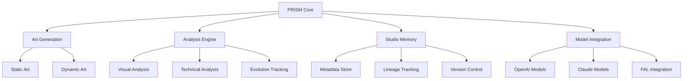

# PRISM - Pattern Recognition & Interactive Studio Machine

<div align="center">
  

  <p align="center">
    
    
    
    
  </p>
</div>

PRISM is an AI-powered creative studio agent that generates both dynamic animated artworks and static visual pieces. It functions as an autonomous creative partner, learning and evolving from each artistic creation while maintaining a comprehensive understanding of its creative journey.

<div align="center">
  <h3>🎨 Dynamic Art • 🖼️ Visual Pieces • 🧬 Creative Evolution • 📊 Artistic Analysis</h3>
</div>

## 🚀 Quick Start

1. Clone and install:
   ```bash
   git clone https://github.com/P-R-I-S-M-PROJECT/P.R.I.S.M.git
   cd P.R.I.S.M
   pip install -r requirements.txt
   ```

2. Create a `.env` file with your API keys:
   ```bash
   OPENAI_API_KEY=your_openai_key_here
   ANTHROPIC_API_KEY=your_anthropic_key_here
   FAL_KEY=your_fal_key_here
   ```

3. Run:
   ```bash
   python prism.py
   ```

## ✨ Key Features

- **🎨 Versatile Art Creation**: Generate both dynamic animations and static visual pieces
- **🔄 Variation System**: Create multiple unique variations of any artwork with custom instructions
- **🤖 Adaptive AI**: Intelligent prompt generation that adapts to your artistic vision
- **🌈 Style Fusion**: Seamless blending of different artistic elements and approaches
- **🎯 Multi-Model Suite**: OpenAI, Anthropic & FAL models working in harmony
- **🧬 Creative Evolution**: Self-improving system that learns from each creation
- **📊 Deep Analysis**: Comprehensive evaluation of visual and technical elements
- **📝 Studio Memory**: Maintains artistic lineage and creative development history
- **🎲 Generation Modes**: Choose between guided wizard or random generation for static art
- **🔍 Focused Prompts**: Streamlined prompt generation with clear, concise results

## 🎮 Interactive Studio Interface

### Main Menu
1. **Create New Art**
   - Static Visual Art
   - Dynamic Animations
   - Choose Generation Mode
   - Select AI Model

2. **Variation Mode**
   - Browse Existing Art
   - Create Variations
   - Batch Processing
   - Custom Instructions

3. **Studio Tools**
   - Organization
   - Debug Mode
   - Model Testing
   - Batch Operations

### Creation Process
1. **Initial Setup**
   - Choose art type
   - Select generation mode
   - Pick AI model

2. **Prompt Creation**
   - Guided wizard or random
   - Clear, concise prompts
   - AI-assisted refinement

3. **Generation**
   - Real-time progress
   - Preview capabilities
   - Parameter adjustment

4. **Review & Iterate**
   - Analyze results
   - Create variations
   - Fine-tune parameters

## 🎨 Art Generation System

### Static Art Creation
PRISM offers two intuitive approaches for creating static visual pieces:

#### 1. Guided Wizard Mode
- Step-by-step prompt building process
- Choose from curated categories:
  - Subject matter (landscapes, abstracts, etc.)
  - Artistic style (impressionist, minimalist, etc.)
  - Color palette and mood
  - Additional elements and details
- AI-assisted prompt refinement
- Maintains artistic coherence
- Perfect for intentional creation

#### 2. Random Generation Mode
- Quick, AI-curated prompt creation
- Balanced element selection
- Unexpected creative combinations
- Ideal for exploration and discovery
- Maintains PRISM's artistic standards

### Dynamic Art Creation
Create evolving, animated artworks:
- Algorithm-driven pattern generation
- Real-time parameter manipulation
- Multiple animation techniques
- Frame-by-frame control
- Export as video or GIF

### Creative Models
- Random (Equal Representation)
- OpenAI (O1, O1-mini, 4O)
- Claude (3.5 Sonnet, 3 Opus)
- Flux (Static Visuals)

## 🔄 Variation System

PRISM's variation system allows deep exploration of artistic ideas:

### Features
- Create multiple variations of any artwork
- Specify custom modification instructions
- Batch generation of variations
- Preserve artistic lineage
- Maintain technique consistency

### Variation Types
1. **Style Variations**
   - Modify artistic approach
   - Explore different techniques
   - Maintain core subject matter

2. **Subject Variations**
   - Keep artistic style
   - Change primary elements
   - Explore new compositions

3. **Technical Variations**
   - Adjust parameters
   - Modify algorithms
   - Fine-tune animations

### Batch Processing
- Generate multiple variations at once
- Specify number of variations (1-10)
- Review and compare results
- Select and refine favorites

## 📈 Analysis & Evolution

### Artwork Analysis
- Visual element evaluation
- Technical parameter review
- Style classification
- Complexity assessment
- Innovation scoring

### Creative Evolution
- Learning from successes
- Pattern recognition
- Style development
- Technique refinement
- Artistic growth tracking

## 🤝 Best Practices & Tips

### For Static Art
1. Start with guided wizard for learning
2. Use random mode for inspiration
3. Keep prompts concise (under 30 words)
4. Create variations to explore ideas
5. Save successful approaches

### For Dynamic Art
1. Begin with basic patterns
2. Gradually add complexity
3. Test parameter ranges
4. Save successful configurations
5. Document technical settings

### For Variations
1. Start with successful pieces
2. Make incremental changes
3. Batch process for exploration
4. Track artistic lineage
5. Document modifications

### General Tips
1. **Prompt Building**
   - Use clear, specific language
   - Focus on key elements
   - Balance detail and brevity
   - Consider visual hierarchy

2. **Model Selection**
   - Match model to task
   - Consider style requirements
   - Test different approaches
   - Document preferences

3. **Studio Organization**
   - Name files consistently
   - Track variations
   - Document processes
   - Maintain backups

## 🏗️ Technical Details

### Requirements
- Python 3.8+
- Processing 4.0+ (must be installed at "C:\Program Files\processing-4.3\processing-java.exe")
- PowerShell 7+ (Windows)
- FFmpeg (Download from https://ffmpeg.org/download.html and place ffmpeg.exe in the scripts/ directory)
- FAL API key for static artwork creation

### Studio Structure
```
prism/
├── data/           # Creative database and metadata
├── models/         # AI model integrations
├── renders/        # Generated pieces and metadata
│   └── snapshots/    # Historical artwork files
└── scripts/        # Contains run_sketches.ps1 and ffmpeg.exe
```

### System Architecture



### Technical Stack

1. **Core Technologies**
   ```
   ├── Python 3.8+          # Main runtime
   ├── Processing 4.0+      # Visual generation
   ├── PowerShell 7+        # System integration
   └── FFmpeg              # Media processing
   ```

2. **AI Integration**
   ```
   ├── OpenAI API          # GPT-4 & DALL-E
   ├── Anthropic API       # Claude models
   ├── FAL API            # Image generation
   └── Custom Models      # Local processing
   ```

3. **Data Management**
   ```
   ├── SQLite             # Local database
   ├── JSON              # Configuration
   ├── Metadata          # Artwork info
   └── File System      # Asset storage
   ```

### Processing Pipeline

1. **Input Processing**
   - User command parsing
   - Configuration loading
   - Resource validation
   - State initialization

2. **Generation Flow**
   - Model selection
   - Prompt processing
   - Resource allocation
   - Output generation
   - Quality validation

3. **Post-Processing**
   - Output formatting
   - Metadata creation
   - Analysis execution
   - Storage management
   - History updating

4. **System Integration**
   - API coordination
   - Resource cleanup
   - Error handling
   - State persistence
   - Event logging