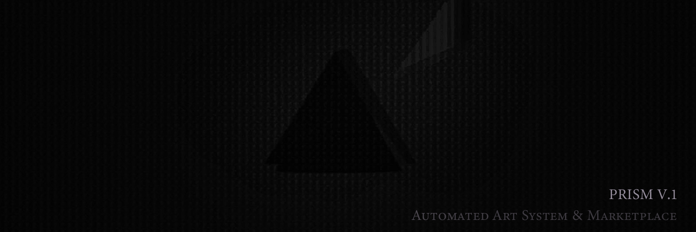

<div align="center">
  

  <p align="center">
    
    
    
    
  </p>
</div>

# PRISM - Pattern Recognition & Interactive Sketch Machine

PRISM is an AI-driven creative system that generates sophisticated geometric animations using Processing and static images using FAL API. It functions as an interactive art studio with evolutionary memory, treating each creation as a data point in a living system.

<div align="center">
  <h3>🎨 Animations • 🖼️ Static Images • 🧬 Evolution • 📊 Analysis</h3>
</div>

## 🚀 Quick Start

1. Clone and install:
   ```bash
   git clone https://github.com/P-R-I-S-M-PROJECT/P.R.I.S.M.git
   cd P.R.I.S.M
   pip install -r requirements.txt
   ```

2. Create a `.env` file with your API keys:
   ```bash
   OPENAI_API_KEY=your_openai_key_here
   ANTHROPIC_API_KEY=your_anthropic_key_here
   FAL_KEY=your_fal_key_here
   ```

3. Run:
   ```bash
   python prism.py
   ```

## 🎯 Core Features

- **🤖 Multi-Model AI Generation**: OpenAI, Anthropic & FAL for diverse creative output
- **🧬 Evolution System**: Adaptive generation based on performance
- **📊 Analysis Pipeline**: Comprehensive evaluation of visual and technical aspects
- **📝 Auto-Documentation**: AI-powered insights about patterns and techniques

## 💻 Technical Requirements

- Python 3.8+
- Processing 4.0+ (must be installed at "C:\Program Files\processing-4.3\processing-java.exe")
- PowerShell 7+ (Windows)
- FFmpeg (Download from https://ffmpeg.org/download.html and place ffmpeg.exe in the scripts/ directory)
- FAL API key for static image generation

## 📁 Project Structure

```
prism/
├── data/           # Database and metadata storage
├── models/         # AI model integrations
├── renders/        # Generated animations/images and metadata
│   └── snapshots/  # Archived sketch files
└── scripts/        # Contains run_sketches.ps1 and ffmpeg.exe
```

## 🎮 Interactive Menu System

PRISM provides an intuitive menu system:

### 1. Generate Patterns
- Single Pattern Generation
- Multiple Pattern Generation
- Continuous Generation
- Model Selection
- Static Image Generation

### 2. Model Selection
- Random (Equal Weights)
- OpenAI (O1, O1-mini, 4O)
- Claude (3.5 Sonnet, 3 Opus)
- Flux (Static Images)

### 3. System Tools
- Cleanup System
- Toggle Debug Mode
- Model Testing Suite

## 🏗️ System Architecture

### Core Components
```
├── prism.py              # Main orchestration
├── code_generator.py     # Pattern generation engine
├── pattern_analyzer.py   # Frame analysis system
├── pattern_evolution.py  # Technique evolution
├── tests.py             # Model testing framework
├── models/              
│   ├── openai_o1.py     # O1 model integration
│   ├── openai_4o.py     # 4O model integration
│   ├── claude_generator.py  # Claude integration
│   └── flux.py          # FAL Flux integration
```

## 🔄 Pipeline Overview

1. **🎯 Technique Selection**
   - Historical performance analysis
   - Success rate weighting
   - Innovation factors
   - Synergy calculations

2. **🤖 Generation**
   - Multi-model approach
   - Code or image generation
   - Validation and error handling
   - Quality assurance

3. **🎨 Rendering**
   - Processing animations
   - Static image generation
   - Metadata handling
   - Analysis integration

4. **📊 Analysis**
   - Visual complexity
   - Motion quality
   - Aesthetic evaluation
   - Performance metrics

5. **🧬 Evolution**
   - Pattern adaptation
   - Technique refinement
   - Style consistency
   - Performance tracking

## 🧪 Testing Framework

Comprehensive testing modes for all models:

1. **O1 Test Mode**
   - Isolated testing
   - Performance tracking
   - Error analysis

2. **Claude Test Mode**
   - Model comparison
   - Generation pipeline
   - Quality assessment

3. **Flux Test Mode**
   - Image generation
   - Style evaluation
   - Quality metrics

## 📄 License

MIT License - See LICENSE file

---

<div align="center">
  <p>
    <a href="https://github.com/P-R-I-S-M-PROJECT/P.R.I.S.M/issues">Report Bug</a>
    ·
    <a href="https://github.com/P-R-I-S-M-PROJECT/P.R.I.S.M/issues">Request Feature</a>
  </p>
</div> 